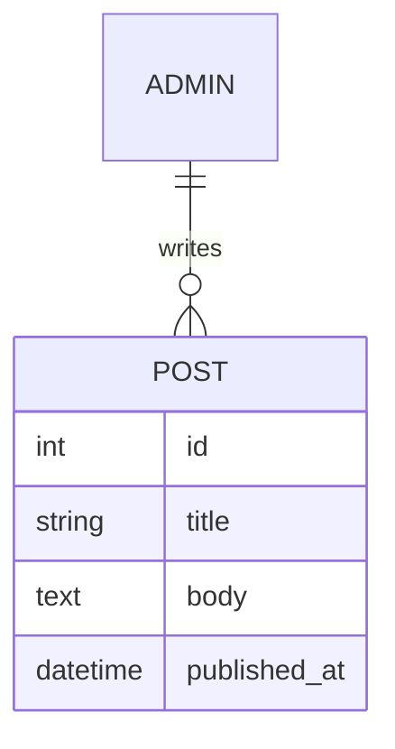

# 기술 설계서

## 1. 기술 관점 요구사항 요약
| REQ ID | 요구사항 | 기술적 고려 사항 |
|---|---|---|

## 2. 기술 스택
> 기준: `.claude/reference/stack-presets.md` (프리셋 상세·카탈로그·표준 명령 매핑). 프리셋 변경은 CR 필요.

### 2.1 스택 프리셋
| 항목 | 내용 |
|---|---|
| 확정 프리셋 | static / kr-shared / react-spring / custom (ADR: ) |
| 프리셋 안의 세부 선택 | 예: CodeIgniter 4 vs Laravel / 페이지별 SSG·SSR |
| 외부 서비스로 대체한 기능 | 폼·CMS·예약·결제 등 |
| 관련 고객 제약 (REQ-N) | |

### 2.2 선택 결과
| 영역 | 선택 | 검토한 대안 | 선택 근거 |
|---|---|---|---|
| 프론트엔드 | Astro / Next.js / Nuxt / 순수 HTML(예외) | | |
| 화면 렌더링 방식 | 프론트 + API 분리 / 백엔드 템플릿 서버 렌더링 / 정적만 (react-spring은 아래 페이지별 표) | | |
| 백엔드 | 없음 / Spring Boot / Laravel / CodeIgniter 4 / Django | | |
| DB | 없음 / PostgreSQL / MySQL·MariaDB | | |
| 스타일링 | CSS 변수 / Tailwind (디자인 프로필) | | |
| 폼 처리 | | | |
| 이미지 최적화 | | | |
| 분석·외부 연동 | | | |
| 호스팅 전제 | | | |

고객 운영 관점 (콘텐츠 수정 난이도, 비용):

### 2.2-1 페이지별 렌더링 (react-spring · Next.js 사용 시)
| SCR ID | 페이지 | SSG / SSR | 근거 (개인화·실시간·SEO) |
|---|---|---|---|

### 2.2-2 호스팅 환경 확인 (kr-shared)
| 항목 | 확인 결과 | 확인 출처·일자 |
|---|---|---|
| PHP 버전 · 확장 | | |
| SSH · SFTP · Composer | | |
| cron | | |
| DB 종류 · 버전 | | |
| 웹 루트 위치 · 상위 디렉토리 쓰기 | | |
| `.htaccess` · mod_rewrite | | |
| SSL · 메일 발송 제한 · 업로드 용량 · 백업 | | |

### 2.3 버전 · 지원 종료 (EOL)
| 구성 요소 | 버전 (정확히) | 지원 유형 (LTS 등) | EOL 일자 | 확인 출처 |
|---|---|---|---|---|
| Node.js (프론트 빌드) | | | | |
| 프론트엔드 프레임워크 | | | | |
| 백엔드 런타임 (JDK / PHP / Python) | | | | |
| 백엔드 프레임워크 | | | | |
| DB | | | | |

### 2.4 의존성
| 패키지 | 용도 | 라이선스 | 필요 이유 (대안 대비) |
|---|---|---|---|

## 3. 디렉토리 구조
```
developer/site/
├── README.md        # 설치·실행·빌드 방법 (표준 명령 매핑 포함)
├── .env.example
├── compose.yaml     # (백엔드 시) 로컬 DB
└── …                # 분리 구성이면 web/ (프론트) · api/ (백엔드)
```

## 4. 화면 · 컴포넌트 매핑
디자인 토큰 파일: (예: `src/styles/tokens.css` — 단일 출처)

| SCR / CMP | 구현 파일 | 비고 |
|---|---|---|

## 5-0. 외부 서비스 후보 비교 (PM 결정 — `CLAUDE.md` §8)
> 유료이거나 개인정보·고객 데이터가 전달되는 서비스는 후보만 비교하고 PM이 선택한다(ADR). 선택 전에는 구현하지 않는다.

| 용도 | 후보 | 비용 (월) | 전달되는 데이터·처리 위치 | 장단점 | 권고 | PM 결정 (ADR) |
|---|---|---|---|---|---|---|

## 5-1. 데이터 모델 (백엔드가 있을 때 — 없으면 "해당 없음")
요구사항 §5.2 콘텐츠 유형·§3.3 폼 정의를 테이블로 옮긴다.



| 테이블 | 근거 (콘텐츠 유형·폼) | 주요 컬럼·제약 | 개인정보 컬럼 (보유 기간) | 인덱스 |
|---|---|---|---|---|

## 5-2. API 목록 (프론트·백엔드 분리 시)
| 메서드 · 경로 | 용도 (SCR·REQ) | 권한 | 입력 (검증) | 출력 · 오류 코드 |
|---|---|---|---|---|

## 5-3. 인증 · 권한 (관리자·회원이 있을 때)
| 항목 | 설계 |
|---|---|
| 권한 구현 | IA §5-1 권한표 → 역할·검사 위치(미들웨어·필터) |
| 초기 관리자 계정 | 생성 방법(시드·명령). **초기 비밀번호는 문서에 쓰지 않고** PM에게 전달하는 방법만 적는다 |
| 비밀번호 정책 | 길이·조합, 해시(bcrypt/argon2), 재설정 방법 |
| 세션 | 만료 시간, 쿠키 속성(HttpOnly·Secure·SameSite), 로그아웃 |
| 로그인 보호 | 시도 제한·잠금, 관리자 경로 노출 최소화 |
| 감사 기록 (선택 — PM 결정) | 관리자 주요 작업 기록 여부 |

## 5-4. P2 산출물 구현 설계
| 항목 | 근거 | 구현 방식 |
|---|---|---|
| 폼 처리 · 메일 발송 | 요구사항 §3.3 | 처리 위치(외부 폼 서비스 / 백엔드), 수신처, 자동 회신, 스팸 방지, **로컬 테스트**(Mailpit 등 / 서비스 테스트 모드) |
| 개인정보 보유 · 파기 | §3.3 보유 기간 | 자동 삭제(cron·스케줄러) / 운영 가이드 수동 절차 |
| 리다이렉트 | IA §7.1 | `_redirects`·호스팅 설정 / `.htaccess` / 프레임워크 라우팅 |
| SEO 메타 · sitemap · robots | 화면정의서 SCR별 메타, IA §6 | 메타 주입 방식, sitemap 생성(빌드 시 자동), 프리뷰 noindex |
| 측정 이벤트 (PM 승인 시) | 요구사항 §4.1 | 이벤트 이름·발생 위치 |
| 미확정 콘텐츠 | QNA | 사이트에 `[TBD: Q-xxx]` 문자열 그대로 노출 (배포 전 grep 0건 확인용) |

## 5. 외부 연동 · 환경 변수
| 이름 | 용도 | 필수 | 비고 (값 기록 금지) |
|---|---|---|---|

## 6. 로컬 개발 환경
| 항목 | 내용 |
|---|---|
| 요구 런타임 | (2.3 버전 표 기준 — Node / JDK / PHP·Composer / Python·uv) |
| 로컬 DB | (Docker Compose / 대안과 운영 DB 차이) |
| 개발 서버 주소 | 프론트: · 백엔드: |
| 빌드 출력 디렉토리 | |

### 6.1 표준 명령 매핑
> qa·devops는 이 표만 보고 실행한다. Windows·macOS 양쪽에서 동작해야 한다 (Gradle은 Windows에서 `gradlew.bat`).

| 표준 명령 | 프론트엔드 | 백엔드 | 비고 |
|---|---|---|---|
| install | | | |
| dev | | | |
| build | | | |
| preview | | | |
| test | | | |
| lint | | | |
| check | | | lint + 타입 + 테스트 |
| migrate | | | |
| seed (테스트 데이터) | | | |
| audit | | | |

## 7. 품질 구현 방안
| 항목 | 구현 방법 |
|---|---|
| 반응형 | |
| 접근성 | |
| SEO (메타, OG, sitemap, robots) | |
| 성능 (이미지, 폰트, 번들) | |
| 보안 (입력 검증, 비밀 정보) | |
| 백엔드 보안 (CSRF, 인증·권한, 비밀번호 해시, 업로드 검증, rate limit, 오류 비노출, 로그 개인정보) | |
| API 문서 (OpenAPI) | |
| 테스트 전략 (단위·통합·주요 엔드포인트) | |
| 보안 헤더 | HSTS, `X-Content-Type-Options: nosniff`, `X-Frame-Options`/`frame-ancestors`, `Referrer-Policy`, CSP(허용 외부 출처 목록) — 설정 위치: 정적 호스팅 헤더 파일 / `.htaccess` / Spring Security 등 |
| 운영 로그 · 오류 알림 (백엔드) | 로그 위치·보관 기간(개인정보 미기록), 오류 알림 방식(메일·호스팅 모니터링) → 운영 가이드 |

### 7.1 성능 예산 (자체 점검에서 확인)
| 항목 | 예산 | 측정 방법 |
|---|---|---|
| 페이지당 JS (압축 후) | 예: 100KB 이하 (정적) | 빌드 결과 크기 |
| 페이지당 CSS | 예: 50KB 이하 | |
| LCP 이미지 | 예: 200KB 이하, 적절한 크기·형식 | |
| 웹폰트 합계 | 예: 300KB 이하 (subset 후) | |
| 저장소 내 단일 이미지·폰트 | 예: 1MB 이하 (원본은 `design/assets/`) | |

## 8. 구현 순서 (작업 단위)
> 각 행이 **developer 1회 호출 = 1커밋**이 되는 작업 단위다. 한 번에 끝낼 수 있는 크기(페이지 2~4개 또는 기능 1개)로 나눈다. 마지막 단위는 자체 점검·디자인 QA 스크린샷·개발 보고서 완성.

| # | 작업 단위 | 관련 SCR/REQ/CMP | 완료 확인 방법 |
|---|---|---|---|
| 1 | 프로젝트 초기화, 디자인 토큰 적용, 공통 레이아웃(헤더·푸터) — 목업 마크업을 출발점으로 컴포넌트화 | | build 성공 + **초기 정합 스크린샷**(designer 확인) |
| 2 | | | |
| n | 자체 점검 · 성능 예산 · 디자인 QA 스크린샷 · 개발 보고서 | 전체 | `check` 통과, 스크린샷 |
| (백엔드) | 보안 코드 리뷰 지적 반영 | | 리뷰 Must 0 |

## 9. 기술 리스크
| 리스크 | 영향 | 대응 |
|---|---|---|

## 변경 이력
| 버전 | 일자 | 작성자 | 내용 | 관련 리뷰/CR |
|---|---|---|---|---|
| 0.1 | | developer | 최초 작성 | |
