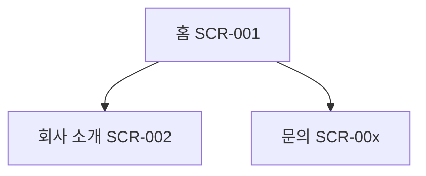

# 정보구조 (IA)

## 1. 사이트맵

(G2 보고에서 PM이 한눈에 볼 수 있도록 mermaid로 작성한다. 관리자 영역은 별도 서브그래프로 구분한다.)

## 2. 메뉴 구조
### 2.1 GNB (주 메뉴)
| 1depth | 2depth | SCR ID | URL | 비고 |
|---|---|---|---|---|

### 2.2 Footer 메뉴
| 항목 | 링크 대상 | 비고 |
|---|---|---|

### 2.3 기타 (유틸 메뉴, 플로팅 버튼 등)

## 3. 페이지 목록
| SCR ID | 페이지명 | URL | 페이지 유형 (메인/목록/상세/폼/정적) | 관련 REQ | 우선순위 |
|---|---|---|---|---|---|

## 4. 주요 사용자 흐름
### Flow-1: (예: 첫 방문자 → 서비스 확인 → 문의)
| 단계 | 화면 | 사용자 행동 | 다음 화면 |
|---|---|---|---|
| 1 | SCR-001 | | |

## 5. 공통 요소
| 요소 | 노출 위치 | 구성 | 관련 REQ |
|---|---|---|---|
| 헤더 | 전 페이지 | 로고, GNB, (모바일) 햄버거 메뉴 | |
| 푸터 | 전 페이지 | 회사 정보, 약관·개인정보처리방침 링크 | |

## 5-1. 관리자 영역 (관리자 기능이 있을 때)
| SCR ID | 관리 화면 | URL (예: `/admin/...`) | 관리 대상 (콘텐츠 유형) | 접근 권한 |
|---|---|---|---|---|

**권한표**
| 기능 | 최고 관리자 | 일반 관리자 | 비회원·방문자 |
|---|---|---|---|
| 게시물 등록·수정·삭제 | ✅ | ✅ | ❌ |
| 관리자 계정 관리 | ✅ | ❌ | ❌ |

## 6. URL · SEO 규칙
- URL 규칙: 소문자 영문 kebab-case, 예) `/about`, `/services/web-design`
- title 패턴: `{페이지명} | {사이트명}`
- description 작성 기준:
- 404 페이지:

## 7. 리뉴얼 대응 (기존 사이트가 있을 때)
### 7.1 URL 리다이렉트 맵
기존 URL이 검색 결과·외부 링크에 남아 있으므로 **모든 주요 기존 URL을 새 URL로 301 리다이렉트**한다. 기존 sitemap·주요 메뉴·검색 노출 페이지에서 수집한다(수집 방법과 일자 기록).

| 기존 URL | 새 URL (SCR) | 방식 (301 / 없어짐 → 상위 페이지) | 비고 |
|---|---|---|---|

### 7.2 콘텐츠 이관 목록
| 기존 콘텐츠 (유형·건수) | 이관 여부 (이관 / 재작성 / 폐기) | 방식 (수작업·스크립트) | 담당·기한 | 비고 |
|---|---|---|---|---|

## 변경 이력
| 버전 | 일자 | 작성자 | 내용 | 관련 리뷰/CR |
|---|---|---|---|---|
| 0.1 | | planner | 최초 작성 | |
